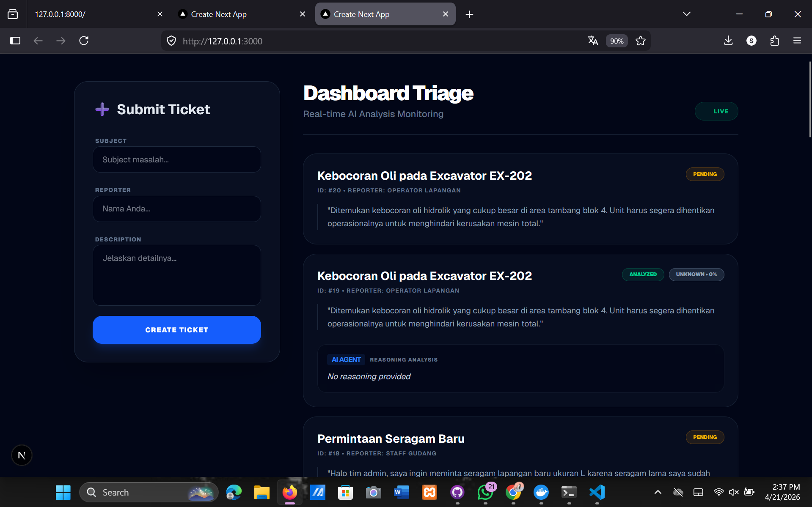
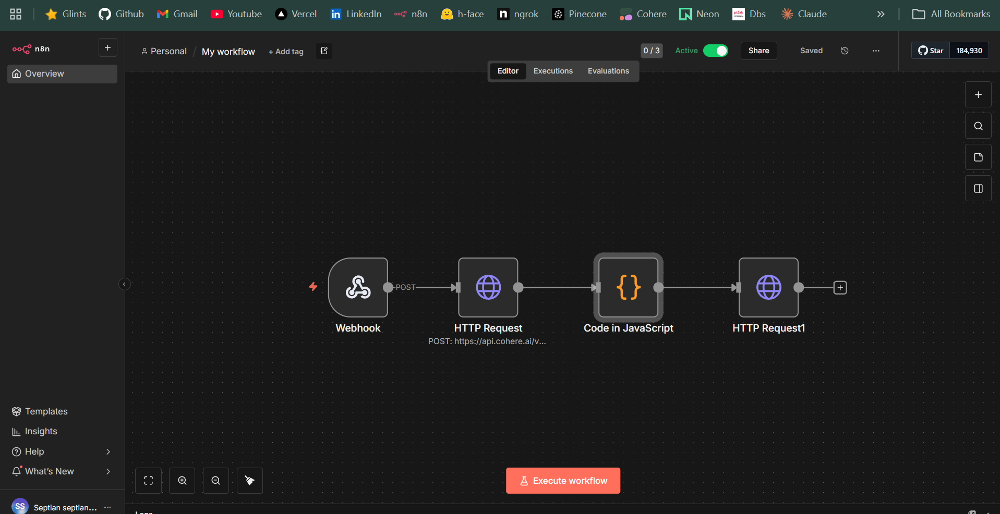
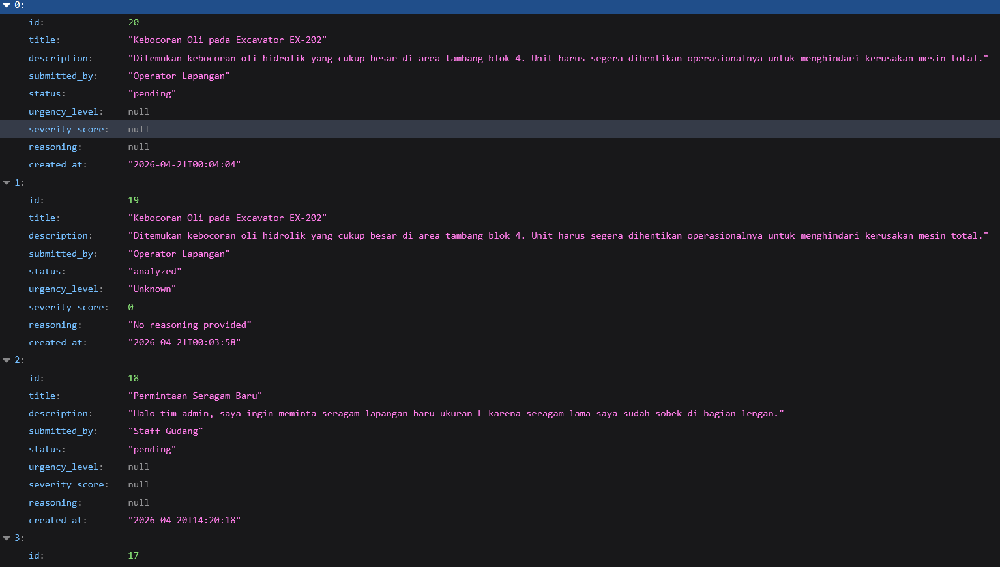

# AI-Powered Support Ticket Triage System

Sistem otomatisasi triage tiket support berbasis AI yang mampu menerima tiket, melakukan klasifikasi tingkat urgensi secara otomatis menggunakan LLM Agent, dan menampilkan hasilnya melalui dashboard real-time. Proyek ini dibangun untuk memenuhi kriteria Technical Assessment Junior Developer.

## 🚀 Fitur Utama
- **Automated AI Triage**: Klasifikasi otomatis tingkat urgensi (Low, Medium, High, Critical) menggunakan Cohere Command-R LLM.
- **Real-time Dashboard**: Monitoring status tiket (Pending -> Analyzed) dengan fitur Live Polling otomatis.
- **AI Reasoning**: Penjelasan logis dari AI untuk setiap klasifikasi yang dilakukan.
- **Modern UI/UX**: Dashboard responsif dengan Dark Mode, badge warna dinamis, dan fitur "Read More" untuk deskripsi panjang.
- **System Logging**: Pencatatan setiap aktivitas sistem untuk audit dan monitoring.

## 🛠️ Tech Stack
- **Frontend**: Next.js 15 (App Router), Tailwind CSS, TypeScript.
- **Backend**: FastAPI (Python 3.13), SQLAlchemy ORM, Pydantic.
- **Database**: MySQL 8.0 (Containerized).
- **Workflow Automation**: n8n (Containerized).
- **LLM Agent**: Cohere AI (Model: `command-r-08-2024`).

## 📊 Physical Data Model (PDM)
Tabel Utama: **`tickets`**
| Field | Type | Description |
| :--- | :--- | :--- |
| `id` | INT (PK) | Primary Key, Auto Increment. |
| `title` | VARCHAR(255)| Judul tiket masalah. |
| `description` | TEXT | Detail deskripsi masalah. |
| `submitted_by` | VARCHAR(255)| Nama/Email pelapor. |
| `status` | ENUM | `pending` atau `analyzed`. |
| `urgency_level`| VARCHAR(50) | Klasifikasi AI (Low, Medium, High, Critical). |
| `severity_score`| INT | Skor tingkat keparahan 1-100. |
| `reasoning` | TEXT | Penjelasan logis hasil analisis AI. |
| `created_at` | TIMESTAMP | Waktu pembuatan tiket. |

## 🔄 Activity Diagram (System Flow)
1. **User** mengisi form tiket di **Next.js Frontend**.
2. **FastAPI** menerima request, menyimpan data ke **MySQL** (`status: pending`), dan mengirim trigger **Webhook** ke n8n.
3. **n8n Workflow** menerima data tiket dan mengirimkan kontennya ke **Cohere AI** dengan prompt terstruktur.
4. **LLM Agent** menghasilkan output JSON berupa tingkat urgensi, skor, dan alasan analisis.
5. **n8n** melakukan callback **PATCH** ke endpoint FastAPI.
6. **FastAPI** mengupdate data di database dan mengubah status menjadi `analyzed`.
7. **Next.js Dashboard** memperbarui tampilan secara otomatis melalui **Live Polling**.

## 📦 Panduan Instalasi & Penggunaan

### 1. Prasyarat
- Docker & Docker Desktop terinstal.
- Python 3.13+ terinstal.
- Node.js terinstal.

### 2. Setup Infrastruktur (Docker)
Jalankan MySQL dan n8n dalam satu perintah:
```bash
docker-compose up -d

## 📸 Dokumentasi Sistem

### Dashboard Utama (Next.js)


### Otomasi Workflow (n8n)


### Dokumentasi API (FastAPI Swagger)

